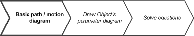
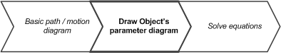
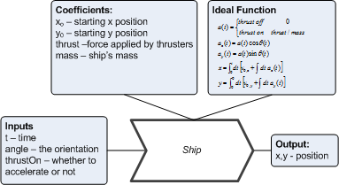
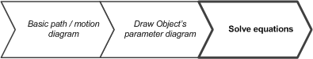

Fly thru Ring
====================

This is a program to fly a ship thru a ring

Demo
------

(click to see video)

The Task
--------

The exercise is to write a procedure **shipNavigate()** that decides how to steer the ship, and if the thrusters should
be turned on.  This procedure is supposed to set two variables:

* *ship_dAngle*  is the amount that the procedure wants to change the ships orientation angle by.  This must be in the range  -15..15 degrees.

* *ship_thrustOn* is set to 0 if the procedure wants the thrusters off, 1 if the procedure wants them on.  The ship will be accelerated in the direction that it is orientated.

The procedure has access to the global state of the game, but it is not allowed to change any.  These
state variables are:

* *ring_x*  is the x coordinate of the ring that the player will to fly into.
* *ring_y*  is the y coordinate of the ring that the player will to fly into.
* *ship_angle* is the ships orientation, in degrees
* *ship_x*   is the ship's x position
* *ship_y*   is the ship's y position
* *ship_v_x* is the ship's x velocity
* *ship_v_y* is the ship's y velocity
* *ship_mass* is the ship's mass
* *ship_thrust* if the force that will be applied to the ship, if the thrusters are on

### Angles

The angles are oriented using the standard mathematical convention that angle 0 is at 3o'clock (on the x axis, on the right)
and that angles increases as in the counterclockwise direction.  The task uses angles in degrees.

### Steps to solve the challenge

In this section I'm going to give a walk-thru in the steps of solving the problem (and generally how to set
of the software to meet challenges in games like this.)

This walk-thru is targeted to an advanced middle school level.  This problem doesn't rely heavily on deriving the
equations -- but you're expected to work out  how to get them into the computer program appropriately.  At an advanced
high-school level, the student should derive the equations.

I will use diagrams; it's tempting to dismiss them, as they are "just" pictures.  Do not.  They help break the problem
down, make it easily solvable (or at least, easier to solve), organize the information you need, and help reduce mistakes.

#### Step 1: Diagram the situation

The first step is diagram the basic event that is happening: the who's, the when's, and the where's.
The objective is to fly a ship thru a ring.  So the "who's" are a ship and a ring.
The "where" is the ring's location.  (When does not matter).

#### Step 2: Describe each of the objects

The next step is to describe the ship and it's flight parameters in a "parameter diagram":

This describes the balls straight-line flight at angle from the point it was shot.  (We'll add gravity in next)
The input to modelling the ball is it's time in the flight, and the result is the location after it's flown.

#### Step 3: Solve the equations, and implement it in code

The next step is to solve the equation.  For the (advanced) middle school student, I will walk thru the steps to this
using the C-language.  There are many other ways of solving this.  A lot of them are fun, and make the ship fly in
an interesting ways.   The (advanced) high school student should work thru the equations and come up with a more
efficient method to get the ship thru the ring faster.

First, get the ship under control:

1. Is the ship moving?  No?  Then we have the ship under control.  Otherwise,
2. Is the ship moving toward the ring?  A simple way to tell is to calculate the angle toward the ring, and the angle
of the ship's velocity (convert it to polar coordintes).  Then subtract one from the other.  Is the value less than (say) 1degree and more than (say) -1degree?   Yes?  Then we have the ship under control.  (This gap of -1 to 1 degree is a _hystersis_ band to prevent buggy behaviour.)  Otherwise.
3. Rotate the ship until it's angle (*ship_angle*) is about the same as the angle of the ship's velocity.  That is, compute the negative of the ship's angle.  Compute the difference between the velocity angles and the negative's ship's angle.  Is the difference more than (say) 1degree and less than (say) -1 degree?  Set *ship_dAngle* to that difference (to turn the ship a bit more) and return.
4. Once the ship is oriented in the opposite direction of it's motion, pulse the thrust on (*ship_thrust* on for one turn then *ship_thrust* off for one turn.)

Next, fly toward the ring:

5. set *ship_thrust* off for now.
6. Is the ship oriented (that is, *ship_angle*) pointing toward the ring?  (To figure this out, follow the steps above).  If so, set *ship_thrust* on, and return.
7. If not, compute the difference between the *ship_angle* and the angle to the ring..
8. Set *ship_dAngle* to that difference, and return.

I'm not going to give explicit steps how to make this algebra, nor am I going to give too explicit of steps on how to
code it.  That's _your_ job.

Requirements
---------------
The was created using the Xcode editor running under Mac OS X 10.8.x or later. 

Credits
-------
The ship images Copyright 2006 Gary C Martin, gary@garycmartin.com
